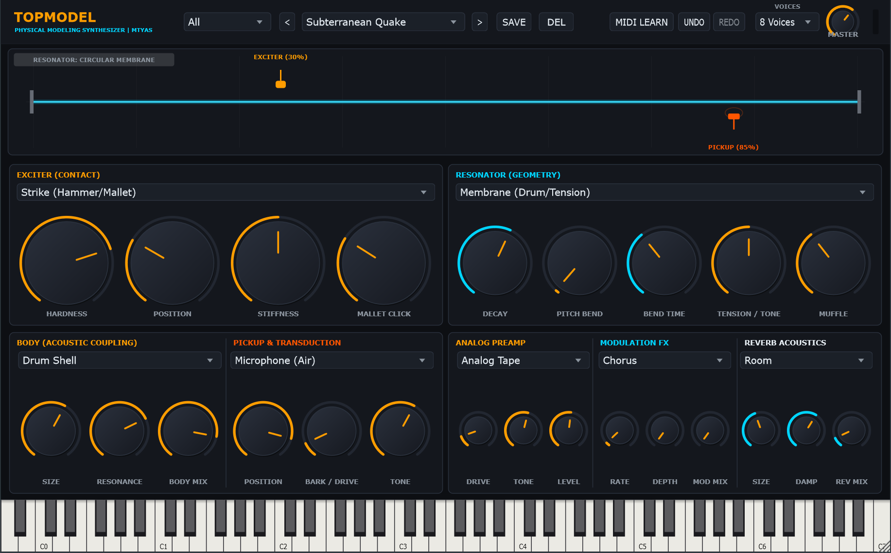

# TopModel

**Physical Modeling Synthesizer** | Created by **mtyas**


---



---

## Overview

**TopModel** is a state-of-the-art acoustic and electro-acoustic physical modeling synthesizer plugin built with modern C++20 and the JUCE framework. 

Unlike conventional sample-based instruments or subtractive synths, TopModel generates **100% of its sound in real time** through mathematical simulation of vibrating bodies: strings, tines, bars, membranes, plates, reeds, and acoustic soundboards. Every note is dynamic, organic, and physically alive—responding dynamically to impact velocity, precedent vibration state, strike momentum, and multi-note sympathetic coupling.

TopModel is released as a **VST3**, **CLAP**, and **Standalone application** for Windows, macOS, and Linux.

---

## Key Highlights

- **4 Physical Exciters**:
  - **Hammer / Mallet Strike**: Hunt-Crossley nonlinear collision mechanics, viscoelastic felt compaction memory on fast repeated strikes, dynamic strike click.
  - **Pluck / Plectrum**: Nonlinear string release deflection with variable plectrum stiffness and angle.
  - **Continuous Bow**: Nonlinear stick-slip friction with Martelé hair bite transient, Raman friction dynamics, and chaotic rosin thermal drift.
  - **Granular Noise**: Micro-impact particle clusters with adjustable density and spatial scatter.
- **7 Resonator Geometries**:
  - **Ideal / Stiff String**: Harmonic modal series with non-linear tension stretch bloom.
  - **Clamped Tine**: Rhodes-style cantilever beam with crystalline bell overtones.
  - **Free Bar**: Marimba, xylophone, and vibraphone tuned bars with authentic suspension nodes.
  - **Circular Membrane**: Drum heads with dynamic tension-drop pitch envelopes.
  - **Metallic Plate**: Heavy gongs and plate reverbs with inharmonic modal dispersion.
  - **Clamped Reed**: Wurlitzer-style electrostatic reed with dominant odd harmonics.
  - **Steelpan Shell**: Tuned concave steelpan surface with acoustic coupling.
- **Multi-Note Sympathetic Bridge Coupling**:
  - Vibrating notes physically drive each other through the soundboard. Harmonic partials (octaves, fifths, fourths) sing sympathetically when neighboring notes are struck.
  - Dampers lift across all notes when the **Sustain Pedal (CC 64)** is pressed, yielding an authentic acoustic grand soundboard bloom.
- **10 Acoustic Body Models & 5 Transducers**:
  - Acoustic Guitar, Piano Soundboard, Cello Body, Rhodes Tonebar, Drum Shell, Wurli Bar, Harp Soundbox, Marimba Resonator, Steel Drum Barrel.
  - Electromagnetic Single-Coil, Piezo Contact, Studio Microphone, Electrostatic Comb, and Clavinet Dual-Coil pickups.
- **Multi-FX Suite**:
  - **Analog Preamp**: Clean, Tube ADAA (Anti-Derivative Anti-Aliasing), and Analog Tape Saturation.
  - **Modulation FX**: 7 selectable modes—Chorus, Tremolo, Flanger, 3-Phase BBD Ensemble, Phaser, Wow & Flutter, Tape Delay.
  - **Reverb Acoustics**: Plate, Room, Hall, and Spring reverbs.
- **Real-Time Physical Visualizer**:
  - Continuous modal phasor envelope tracking ( = \sqrt{x_m^2 + y_m^2}$).
  - Multi-mode standing wave display that stays alive and rippling throughout sustain and long decays.
  - Animated hammer strike/spring rebound, lateral bow stick-slip draw, and pulsing magnetic flux pickup arcs.
- **202 Handcrafted Factory Presets**:
  - Organized into 6 synthetic categories: Bass, Lead, Keys, Plucks, Pads, Percussion.
  - Zero generic instrument clones—inventive, modern, and expressive acoustic and electronic sounds.
- **Comprehensive Preset Manager**:
  - Save to any category or create custom categories.
  - Overwrite factory presets seamlessly in user storage.
  - Dedicated DEL button to permanently erase presets (persisted in %LOCALAPPDATA%/TopModel/Presets).
- **Complete MIDI Learn**:
  - Right-click or toggle MIDI Learn to assign any physical parameter to hardware CC knobs.

---

## User Manual

For an in-depth parameter guide, physical modeling theory, and workflow tips illustrated with detailed screenshots:

📖 **[Read the Full TopModel User Manual](docs/MANUAL.md)**

---

## Installation & Releases

### Pre-Built Binaries

Pre-compiled binary packages for **Windows**, **macOS** (Universal arm64 / x86_64), and **Linux** are available on the [Releases Page](https://github.com/mtyas/TopModel/releases).

| Format | Windows Destination | macOS Destination | Linux Destination |
| :--- | :--- | :--- | :--- |
| **CLAP** | `%LOCALAPPDATA%\Programs\Common\CLAP\TopModel.clap` | `~/Library/Audio/Plug-Ins/CLAP/TopModel.clap` | `~/.clap/TopModel.clap` |
| **VST3** | `%LOCALAPPDATA%\Programs\Common\VST3\TopModel.vst3` | `~/Library/Audio/Plug-Ins/VST3/TopModel.vst3` | `~/.vst3/TopModel.vst3` |
| **Standalone** | Any directory | `/Applications/TopModel.app` | `/usr/local/bin/TopModel` |

### Building from Source

TopModel uses standard **CMake** (v3.22+) and **JUCE 8**.

```bash
# Clone repository
git clone https://github.com/mtyas/TopModel.git
cd TopModel

# Configure build
cmake -B build -DCMAKE_BUILD_TYPE=Release

# Build all targets (VST3, CLAP, Standalone, Tests)
cmake --build build --config Release
```

The compiled binaries will be located in:
- `build/ModelKeys_artefacts/Release/CLAP/TopModel.clap`
- `build/ModelKeys_artefacts/Release/VST3/TopModel.vst3`
- `build/ModelKeys_artefacts/Release/Standalone/TopModel.exe` (or `TopModel.app` on macOS, `TopModel` on Linux)

### Running the Test Suite

TopModel includes a comprehensive 221-point automated calibration and DSP sanity test suite:

```bash
# Windows
./build/Release/ModelKeys_Tests.exe

# macOS / Linux
./build/ModelKeys_Tests
```

---

## License

This project is licensed under the **GNU General Public License v3.0 (GPL-3.0)**. See the [LICENSE](LICENSE) file for details.

Developed with passion by **Matthew Tyas (mtyas)**.
