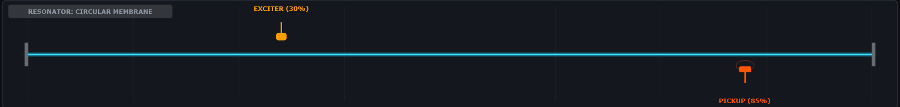
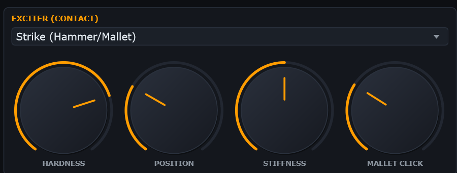
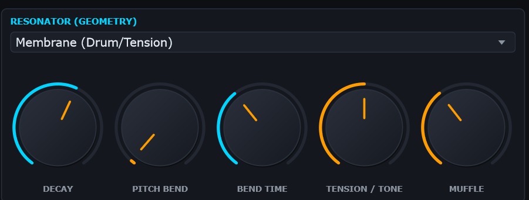
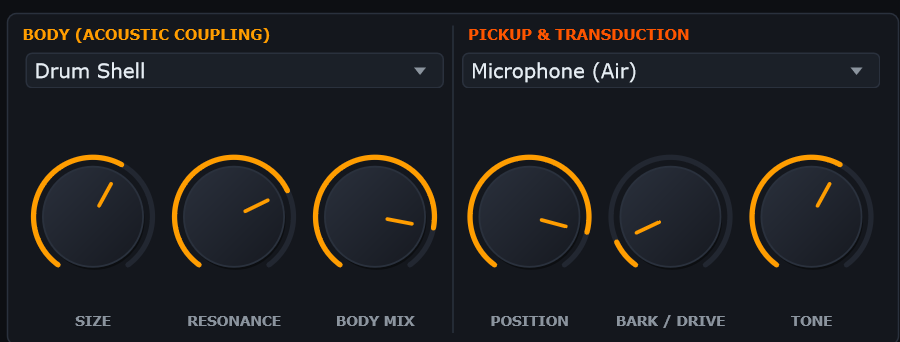
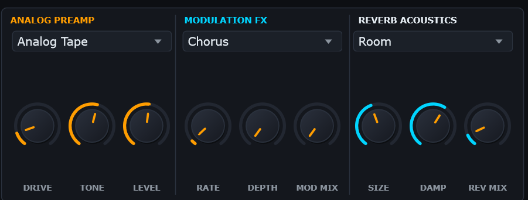
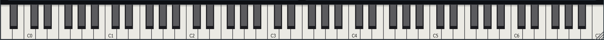

# TopModel User Manual & Physical Modeling Reference Guide

**Version 1.0** | Author: **Matthew Tyas (mtyas)**

---

## Table of Contents

1. [Introduction to TopModel](#1-introduction-to-topmodel)
2. [Interface Overview](#2-interface-overview)
3. [The Header Bar & Preset Management](#3-the-header-bar--preset-management)
4. [Real-Time Physical Visualizer](#4-real-time-physical-visualizer)
5. [The Exciter Engine (Contact Dynamics)](#5-the-exciter-engine-contact-dynamics)
6. [The Resonator Bank (Geometry & Modal Physics)](#6-the-resonator-bank-geometry--modal-physics)
7. [Acoustic Body & Transduction (Pickups)](#7-acoustic-body--transduction-pickups)
8. [Effects Suite (Preamp, Modulation, Reverb)](#8-effects-suite-preamp-modulation-reverb)
9. [Responsive 88-Key Keyboard](#9-responsive-88-key-keyboard)
10. [MIDI Control, Sustain & Mod Wheel Dynamics](#10-midi-control-sustain--mod-wheel-dynamics)
11. [Preset Library Directory](#11-preset-library-directory)

---

## 1. Introduction to TopModel

TopModel is an expressive physical modeling synthesizer. Unlike wavetable, subtractive, or sampled synthesizers, TopModel calculates the mechanical and acoustical physics of physical systems at every audio sample:

\text{Excitation Force } F_c(t) \longrightarrow \text{Modal Resonator Bank } \sum_{m=1}^{M} x_m(t) \longrightarrow \text{Acoustic Body & Transducer} \longrightarrow \text{Multi-FX}

Because every vibration is simulated dynamically:
- **Velocity transforms timbre, not just amplitude**: Striking harder causes nonlinear felt stiffening, brighter spectral overtones, and amplitude-dependent pitch blooms.
- **Precedent vibration alters strike impact**: Consecutive strikes on a vibrating string take into account the string's momentum and compressed hammer felt ({rel} = v_{hammer} - v_{string}$).
- **Sympathetic Resonance**: Active notes couple into one another through the soundboard bridge, allowing open strings to sing harmonically.

---

## 2. Interface Overview

The TopModel interface is arranged into clear logical layers:
1. **Header Bar**: Preset selection, category filtering, preset saving/erasing, undo/redo, voice polyphony, and master output metering.
2. **Physical Scope / Visualizer**: Real-time display of the vibrating standing wave, exciter contact point, and pickup sensor.
3. **Synthesis Row 1**: Exciter Engine (left) and Resonator Modal Bank (right).
4. **Synthesis Row 2**: Body & Pickup Transduction (left) and Multi-FX Engine (right).
5. **Interactive Keyboard**: Full 88-key responsive layout with pitch bend and mod wheel response.

---

## 3. The Header Bar & Preset Management

### Controls

- **Branding Badge**: TOPMODEL | PHYSICAL MODELING SYNTHESIZER | MTYAS.
- **Category Filter Dropdown**: Quickly narrows presets down to All, Bass, Lead, Keys, Plucks, Pads, Percussion, or any user-created custom categories.
- **Previous / Next Buttons (<, >)**: Steps sequentially through presets within the selected category filter.
- **Preset Selector Dropdown**: Displays the active preset name. Clicking opens a menu of all matching presets.
- **SAVE Button**:
  - Prompts a modal dialog to save the current sound.
  - Choose an existing category or type a new custom category name.
  - Saving under the name of an existing pre-built factory preset safely stores a user override in %LOCALAPPDATA%/TopModel/Presets/.
- **DEL Button**:
  - Prompts a confirmation dialog to permanently erase the currently selected preset.
  - Erasing a user preset deletes its XML file from disk.
  - Erasing a factory preset records its name in deleted_presets.txt, persistently removing it from the browser while leaving the base binary intact.
- **MIDI LEARN Button**: When toggled ON, clicking any rotary knob primes it for MIDI CC mapping. Move any hardware MIDI controller knob to complete assignment.
- **UNDO / REDO Buttons**: Step backwards and forwards through parameter adjustments (also mapped to Ctrl+Z / Ctrl+Y).
- **VOICES Selector**: Sets polyphony limit (Mono, 2, 4, 8, 12, or 16 voices).
- **MASTER Volume & LED Meters**: Adjusts final plugin output gain with true peak LED indicators (green $\rightarrow$ amber $\rightarrow$ red clipping).

---

## 4. Real-Time Physical Visualizer

The top visualizer is a physical oscilloscope driven by the instantaneous vibrational state of the active voices:
- **Standing Wave Motion**: Displays the superposition of active modal partials. Uses continuous phasor envelope tracking ( = \sqrt{x_m^2 + y_m^2}$) so that vibrations remain smoothly animated throughout note attack, sustain, and decay.
- **Boundary Conditions**:
  - *Clamped Tine / Reed*: Clamped on the left, maximum excursion at the free vibrating tip on the right.
  - *Free Bar*: Fixed acoustic nodes at  \approx 0.224$ and  \approx 0.776$ (vibraphone suspension points).
  - *Membrane / Steelpan*: Circular boundary clamping with parabolic antinode deflection.
  - *String*: Fixed bridge mounts at both ends with sinusoidal spatial harmonics.
- **Exciter Indicator (Amber)**:
  - Shows current excitation contact position (contactPos).
  - **Draggable**: Drag the exciter left or right in the visualizer to change contact position in real time!
  - Animates hammer strike impact and spring rebound, bow stick-slip horizontal draw, and particle clusters.
- **Pickup Indicator (Orange)**:
  - Shows current transducer position (pickupPos).
  - **Draggable**: Drag the pickup probe along the body to sweep through acoustic nodal nulls.
  - Displays dynamic magnetic flux rings that breathe with passing vibration displacement.

---

## 5. The Exciter Engine (Contact Dynamics)

The Exciter models the physical contact force (t)$ delivered into the resonator.

### Exciter Types

1. **Strike (Hammer / Mallet)**:
   - Simulates felt, rubber, or wooden hammer impacts using the Hunt-Crossley model ( = k \cdot \delta^p + c \cdot \delta^p \cdot v_{rel}$).
   - Fast repeated strikes ($< 250\text{ ms}$) compact the hammer felt, dynamically boosting strike hardness and transient click.
2. **Pluck (Plectrum)**:
   - Deflects string until reaching maximum static displacement, then releases with nonlinear plectrum friction.
3. **Continuous Bow**:
   - Stick-slip friction modeling Helmholtz motion. Features Martelé initial hair bite impulse (instant attack) and microscopic rosin friction thermal drift.
4. **Granular Noise**:
   - Generates stochastic micro-impact particle showers across the resonator surface.

### Parameters

- **Hardness**: Controls the elasticity of the contact head (0.0 = soft felt, 1.0 = hard wood/metal).
- **Position**: Normalized physical contact point along the resonator length (.02$ to .98$).
- **Stiffness**: Spring constant of the contact material during collision.
- **Mallet Click / Strike Click**: High-frequency acoustic transient level generated on initial impact.
- **Rosin Grit (Bow Mode)**: Microscopic friction roughness of the bow hair.
- **Particle Density / Scatter (Noise Mode)**: Frequency and spatial spread of granular impacts.

---

## 6. The Resonator Bank (Geometry & Modal Physics)

The Resonator Bank consists of up to 32 coupled second-order modal oscillators:

\ddot{x}_m + 2\gamma_m \dot{x}_m + \omega_m^2 x_m = \frac{1}{m_{eff}} (F_c \cdot \sin(m \pi \xi) + F_{symp})

### Resonator Geometries

1. **String**: Harmonic overtone series  = m \cdot f_0 \sqrt{1 + B m^2}$.
2. **Clamped Tine**: Cantilever bar (Rhodes) with inharmonic ratios  = f_0 \cdot [1, 6.27, 17.55, 34.39, \dots]$ and bell chime.
3. **Free Bar**: Supported bar (Marimba, Xylophone) with undercut tuning arch ratios  = f_0 \cdot [1, 3.98, 9.25, \dots]$.
4. **Circular Membrane**: Drum head with Bessel function zeros  = f_0 \cdot [1, 1.59, 2.14, 2.30, 2.65, \dots]$.
5. **Metallic Plate**: 2D Chladni plate resonance with dense high-frequency dispersion.
6. **Clamped Reed**: Electrostatic reed (Wurlitzer) with prominent odd harmonics (, 3, 5, 7$).
7. **Steelpan Shell**: Tuned concave steelpan surface with octave and fifth overtone coupling.

### Parameters

- **Decay Time**: Master acoustic decay duration (.02\text{ s}$ to .0\text{ s}$).
- **Pitch Bend / Drop**: Downward membrane tension pitch drop amount (semitones).
- **Bend Time**: Rate of pitch drop decay.
- **Tension / Tone (Brightness)**: Frequency-dependent damping coefficient $\gamma_m$.
- **Muffle (Inharmonicity)**: Controls the stiffness dispersion factor $.
- **Beating Bloom**: Amplitude of detuned orthogonal twin modes (, y2$) creating natural acoustic chorusing and phase beating.
- **Material Balance**: Balances metallic vs. wooden modal damping profiles.

---

## 7. Acoustic Body & Transduction (Pickups)

### Acoustic Body Coupling

Couples the modal resonators to a resonant physical cavity or soundboard:
- **Body Types**: Off, Acoustic Guitar, Piano Soundboard, Violin Body, Rhodes Tonebar, Drum Shell, Wurli Reed Bar, Harp Soundbox, Marimba Resonator, Steel Drum Barrel.
- **Body Size**: Scales the formant resonant frequencies (.5\times$ to .5\times$).
- **Body Resonance**: Q-factor / sharpness of body cavity modes.
- **Body Mix**: Wet/dry balance of acoustic body resonance.

### Pickup Transduction

Converts mechanical vibration into an electrical audio signal:
- **Pickup Types**:
  - Electromagnetic: Magnetic coil measuring string velocity $\dot{x}$.
  - Piezo: Contact transducer measuring pressure/displacement $.
  - Microphone: Measures pressure in acoustic air space.
  - Electrostatic: Measures variable capacitance gap (Wurlitzer reed bark).
  - Clavinet Dual-Coil: Hum-canceling dual magnetic coils with sharp inductive resonance.
- **Position**: Normalized physical location of the pickup sensor.
- **Bark / Drive**: Pushes nonlinear magnetic or electrostatic saturation when vibrating close to the pole piece.
- **Tone**: Post-transduction brightness and low-pass contour.

---

## 8. Effects Suite (Preamp, Modulation, Reverb)

### Analog Preamp

- **Modes**:
  - Clean: Linear ultra-transparent buffer.
  - Tube ADAA: Triode tube emulation using 1st-order Anti-Derivative Anti-Aliasing (ADAA) to eliminate digital aliasing foldback.
  - Analog Tape: Smooth tape hysteresis saturation with gentle high-frequency soft limiting.
- **Drive**: Saturation amount.
- **Tone**: Preamp tilt equalization.
- **Level**: Output trim gain.

### Modulation Multi-FX

- **Modes**:
  - Chorus: True stereo quadrature BBD chorus.
  - Tremolo: Sine/triangular optical amplitude modulation.
  - Flanger: Short BBD delay with regenerative feedback and through-zero phase cancellation.
  - Ensemble: 3-phase modulated multi-voice analog string ensemble chorus.
  - Phaser: 4-stage allpass filter cascade with resonant feedback notch sweep.
  - Wow & Flutter: Dual-rate analog motor drift with tape scrape flutter.
  - Tape Delay: Warm analog tape echo with filtered feedback.
- **Rate**: Modulation frequency (.05\text{ Hz}$ to .0\text{ Hz}$).
- **Depth**: Modulation depth / delay feedback.
- **Mod Mix**: Wet/dry effect balance.

### Reverb Acoustics

- **Types**:
  - Plate: 1960s steel plate reverb with high-density diffusion and sparkling metallic tail.
  - Room: Intimate acoustic studio chamber with natural early reflections.
  - Hall: Expansive concert hall with cathedral pre-delay and smooth long decay.
  - Spring: Dual-spring reverb tank with authentic chirp dispersion and metallic drip.
- **Size**: Virtual room dimensions.
- **Damp**: High-frequency absorption.
- **Rev Mix**: Reverb wet/dry blend.

---

## 9. Responsive 88-Key Keyboard

- Spans standard 88-note acoustic piano range: **A0 (MIDI 21) to C8 (MIDI 108)**.
- 52 white keys dynamically scale to fill 100% of the window width with zero side margins.
- Mouse-click playable with velocity mapped to vertical click position.
- Highlights active notes received via external MIDI in real time.

---

## 10. MIDI Control, Sustain & Mod Wheel Dynamics

- **MIDI CC 64 (Sustain Pedal)**:
  - Lifting the sustain pedal drops dampers onto all active notes.
  - Holding the sustain pedal down lifts dampers across all 88 strings, boosting **Sympathetic Bridge Coupling by .2\times$** for a singing soundboard resonance.
- **MIDI CC 1 (Mod Wheel)**:
  - Dynamically injects organic acoustic vibrato and micro-drift across all active modal resonators.
- **Pitch Bend**:
  - Smoothly bends fundamental frequency in real time **during note sustain and decay** without clicks or mode resets.
- **MIDI Learn**:
  - Click MIDI LEARN in the header bar.
  - Click any rotary knob on the interface.
  - Move a physical fader or knob on your hardware controller to bind CC instantly.
  - CC badges (e.g. CC74) appear automatically in the corner of mapped knobs.

---

## 11. Preset Library Directory

TopModel includes **202 handcrafted factory presets**:

| Category | Presets | Sonic Character |
| :--- | :---: | :--- |
| **Bass** | 32 | Sub-bass quakes, dynamic slaps, biting acid wires, bowed contrabasses, 808 membrane kicks, electrostatic reed pulses. |
| **Lead** | 32 | Singing bowed plates, screaming tube leads, crystalline tine soloists, thereminic glides, cutting sync reeds. |
| **Keys** | 38 | Rhodes-style magnetic tines, Wurlitzer reeds, acoustic grand soundboard blooms, honky-tonks, celestas, and prepared pianos. |
| **Plucks** | 32 | Liquid harps, snappy kotos, dulcimers, sitar jawari buzz, thumb kalimbas, and lute pizzicatos. |
| **Pads** | 32 | Bowed soundboard washes, ambient shimmer plates, frozen glacial drones, granular washes, tape-flutter atmospheres. |
| **Percussion** | 37 | Tectonic gongs, steelpans, log drums, metallic click drums, tuned tablas, taiko punches, and anvils. |

---

*TopModel is open-source software licensed under the GNU General Public License v3.0 (GPL-3.0).*
